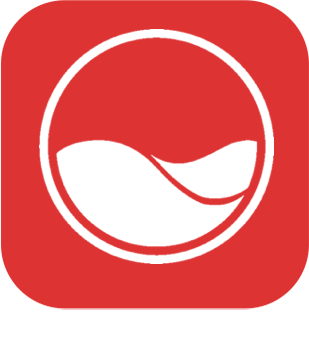

# ondilo - Plugin pour Jeedom

*→ [Lien market](https://market.jeedom.com/index.php?v=d&p=market&type=plugin&plugin_id=3945)* 

Les flotteurs de la gamme Ico conçus par la société Ondilo sont des capteurs Wifi qui permettent l'analyse de votre piscine ou de votre SPA. Installation rapide, connexion Wi-Fi compatible piscines sel, brome ou chlore.. Le plugin Ondilo - ICO pour jeedom vous permet de remonter les informations mises à disposition tels que: 

- La température de l’eau, 
- L’acidité (pH), Le redox (ORP), 
- Le sel, 
- Total des Solides Dissous (TDS), 
- ou encore les recommandations. Il vous est également possible de valider les recommandations depuis un scénario. (Exemple: je dois mettre du chlore, un bouton est situé à côté permet de valider l’action). 

[Changelog](changelog.md) 

## Installation du plugin Ondilo - ICO

L'installation du plugin se fait depuis l'interface gestion des plugins et / ou depuis le market.

## Configuration du plugin Ondilo - ICO

Dans un premier temps vous devez vous authentifier à votre compte Ondilo depuis la page de configuration.



Une nouvelle page va s'ouvrir, vous devez renseigner vos identifiants. (Pas de craintes vous êtes sur le site d'ondilo le fabriquant de l'ICO. Le plugin ne sauvegarde aucun ni login, ni mot de passe).

**ATTENTION** le choix de la langue est important, car les recommandations seront dans la langue sélectionnée.



Une fois connecté, vous revenez sur une page blanche. Vous pouvez fermer celle-ci et recharger votre page de configuration.

Vous pouvez choisir d'utiliser la tuile personnalisé ou les widgets natifs à jeedom. A vous de choisir en cochant cette option.



Ce qui donnera:

> Widget Natif



> Widget (Tuile) personnalisé



### Synchronisation de votre Ondilo - ICO

Il est possible d'avoir plusieurs ilots ICO.



### Les recommandations

Les recommandations sont visibles dans le centre de message:



## FAQ

Est ce que le plugin utlise des API tierces ?

Oui le plugin utilise l'[api officielle de Ondilo]().

## Remerciements

